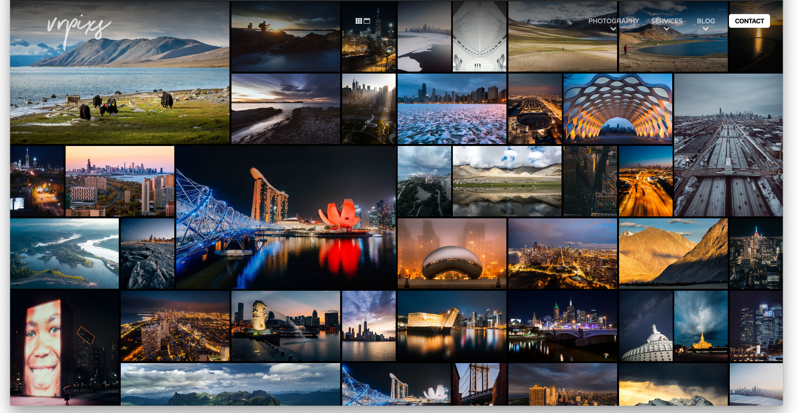
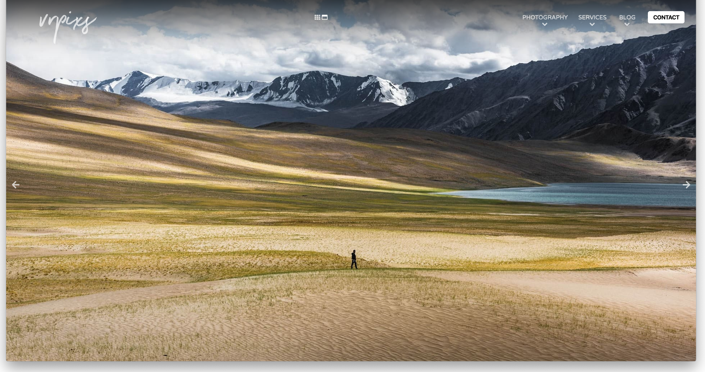
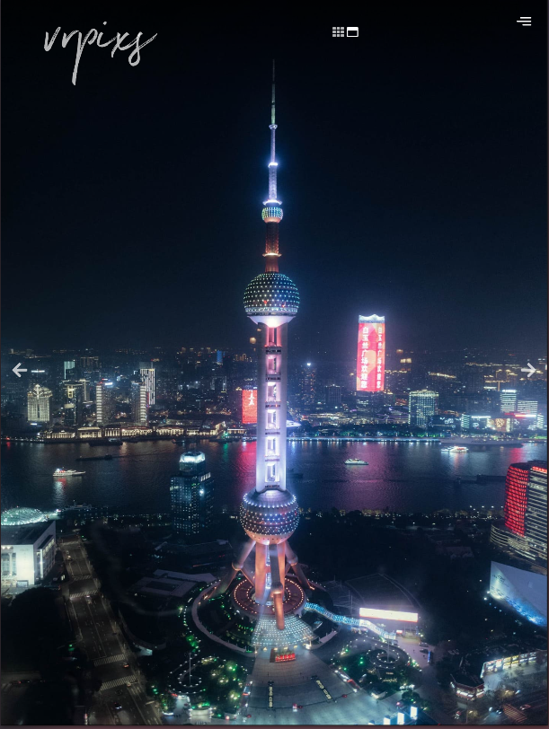

# vrpixs-portfolio

This is a repository for a portfolio website I'm building for my photography. 
The website is still in development where I code parts of the site as I learn web-dev materials.

Website address: http://www.vrpixs.com

## A homepage in a default grid-view on a fullsize browser

## A homepage in a slideshow-view on a fullsize browser
Photos are displayed dynamically depending on device orientation. For example, only horizontally oriented photos are shown to a device in landscape orientation.

## A homepage in a default grid-view on a tablet browser

## A homepage in a slideshow-view on a fullsize browser
Photos are displayed dynamically depending on device orientation. For example, only vertically oriented photos are shown to a device in portrait orientation.

## A homepage in a default slideshow-view on a mobile browser

